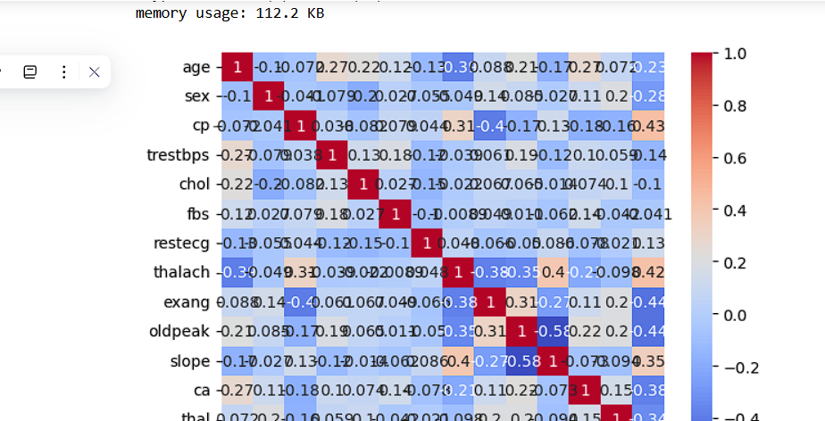
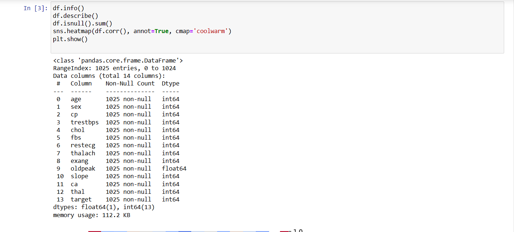

# 💓 Heart Disease Prediction App

This is a **mini machine learning project** that predicts the likelihood of a person having heart disease based on medical parameters such as age, cholesterol level, blood pressure, chest pain type, and more.

It is built using:

- 🧠 **Random Forest Classifier** for prediction
- 📊 **Streamlit** for interactive web app
- 🧮 **Pandas**, **NumPy**, and **Scikit-learn** for data processing and model building

---

## 🔍 Project Overview
The aim of this project is to predict heart disease in patients using a machine learning model trained on the **UCI Heart Disease Dataset**.

Users can input their medical details via a simple web interface and get an **instant prediction** — whether they are at risk of heart disease or not.

---

## 🧠 Features
✅ User-friendly **Streamlit Web App**  
✅ Real-time prediction from trained ML model  
✅ Uses **Random Forest** for accurate results  
✅ Scaled inputs using **StandardScaler**  
✅ Deployed on **Streamlit Cloud** for easy access  

---

## 📊 Exploratory Data Analysis (EDA)

### 1️⃣ Dataset Information
The dataset contains **1,025 entries** and **14 columns** including the target variable (`target`). No missing values were found.



---

### 2️⃣ Sample Data


---

### 3️⃣ Correlation Heatmap
This heatmap shows correlations between features to help understand relationships.


---

## ⚙️ Installation & Setup

### Step 1: Clone the repository
```bash
git clone https://github.com/YourUsername/heart-disease-prediction.git
cd heart-disease-prediction

### Step 2: Install dependencies 
pip install -r requirements.txt

Step 3: Run the App
streamlit run app.py

The app will open in your browser at:
http://localhost:8501

---
📋 Input Parameters in the App

 1) Age: Age in years

 2) Sex: Male or Female

 3) cp: Chest Pain Type (0–3)

 4) trestbps: Resting Blood Pressure

 5) chol: Serum Cholesterol (mg/dl)

 6) fbs: Fasting Blood Sugar > 120 mg/dl (0 or 1)

 7) restecg: Resting ECG results (0–2)

 8) thalach: Maximum Heart Rate Achieved

 9) exang: Exercise Induced Angina (0 or 1)

 10) oldpeak: ST Depression

 11) slope: Slope of Peak Exercise ST Segment (0–2)

 12) ca: Number of Major Vessels (0–3)

 13) thal: Thalassemia (0–3)

---


